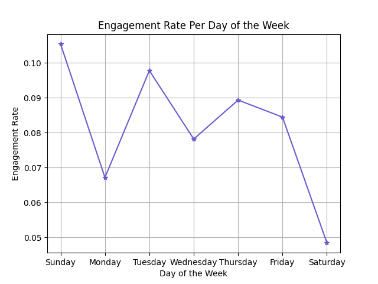
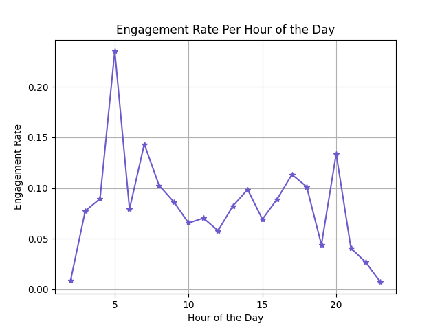
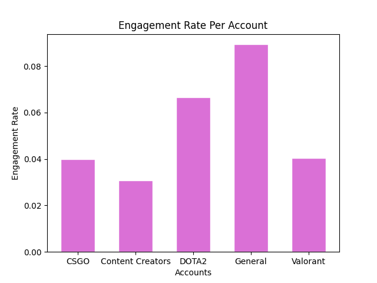
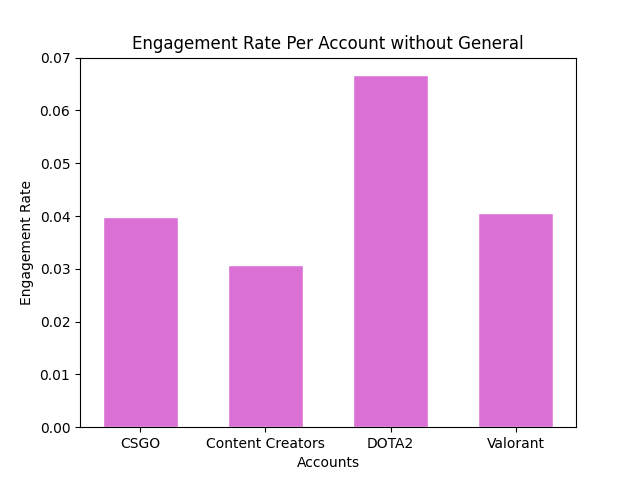
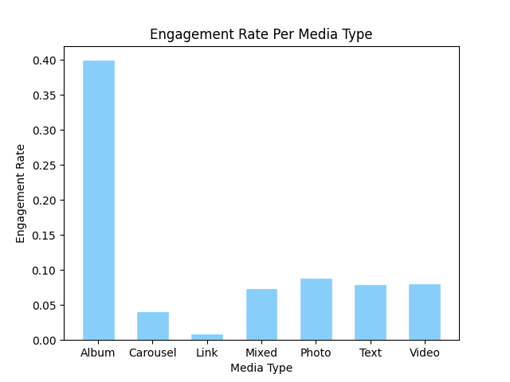
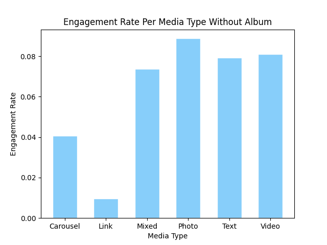
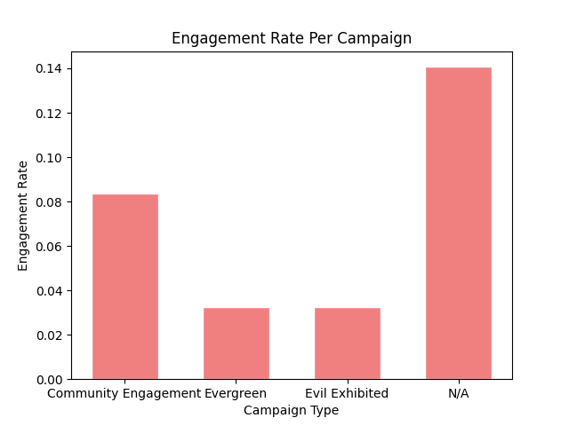
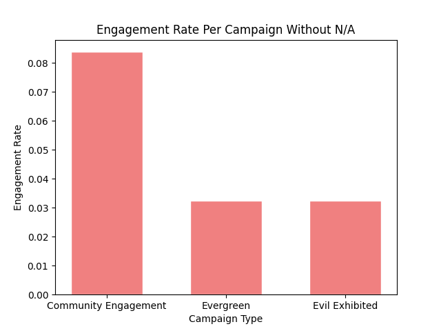

# Evil Geniuses Social Media Analysis  

## 💡Scenario💡  
Evil Geniuses is a professional esports organization with teams competing in various video games. It is one of the most popular and successful organizations in the esports scene and is known for its dedicated fan base and top-tier talent. In this case, I will analyze the social media marketing data to guide marketing strategy for the organization to enhance its engagement rate from the audience. 		

I will be using the six step data analysis process: 
Ask, Prepare, Process, Analyze, Share, Act

## 1. Ask ❓ 

#### Main Goal:   
Analyze social media data to gain insight and help guide marketing strategy for Evil Geniuses to grow its engagement rate.
#### Task 1: 
What is the typical engagement rate EG can expect? What’s the likelihood that we can achieve a 15% engagement rate?
#### Task 2: 
Does day of the week and time of posting affect engagement rates?
#### Task 3:
How are EG game titles doing in terms of social performance? Is there a specific game EG should focus more on or less?
#### Task 4: 
What media type performs the best?
#### Task 5:
What is EG's best performing campaign?
#### Task 6:
Define out a posting strategy for the EG social channels based on discoveries.
#### Task 7:
What suggestions I would give to the social media team if they want to expand their presence (e.g. if our CSGO youtube channel is doing well should we expand to TikTok)?
## 2. Prepare ⚙️  
#### Data Source:   
3000+ Cases of Social Media Data from Jan 1st 2023 to Mar 31st 2023. social_data.xlsx

The dataset contains limitations:   
* There are 1485 Campaigns that are categorized as N/As and not rational to be included specifically to the campign analysis process.  
* There are 9 media types that are categorized as "Carousel", 5 media types that are categorized as "Mixed", and 4 media types that are categorized as "Album" while the rest of the media types are in the counts of hundreds or thousands. It would be improper to evaluate these three media types' engagement rates in the media type analysis process as they have a low simple size in comparision to the other media types.


## 3. Process 💻    
### Explore and examine data
```diff
data = pd.read_excel("social_data.xlsx")
data
```
The start date & time was 01/01/2023 2:59 PM, end date & time was 03/31/2023 07:55 PM.


### Drop duplicate or NA values  
There were 47 duplicate rows, so I updated the data frame without the duplicates.  
```diff
data = data.drop_duplicates()
data
``` 
There were 1485 Campaigns that are categorized as N/As, so I created a new data frame without the N/As.  
```diff
data['Campaign Name'] = data['Campaign Name'].str.strip()
campaign_performance = data.groupby('Campaign Name').agg({'Total Engagements': 'sum', 'Total Impressions': 'sum'})
no_NA = campaign_performance.drop("N/A")
``` 

### Clean Data   
Group the data by day of the week.
```diff
week_order = ['Sunday', 'Monday', 'Tuesday', 'Wednesday', 'Thursday', 'Friday', 'Saturday']
data['day_of_week'] = pd.Categorical(data['day_of_week'], categories=week_order, ordered=True)
data = data.sort_values('day_of_week')
```
Group the data by the hour of the day.
```diff
engagement_by_hour = data.groupby('hour_of_day')
```
This sorts the dataframe by the day of weeks and hour of the day for easier aggregate analysis.

🔧 [Link to Jupyter Notebook](https://github.com/JingChengGu/EG-Social-Analysis/blob/main/social_analysis.ipynb)


## 4. Analyze 📊    
### Task 1: What is the typical engagement rate EG can expect? What’s the likelihood that we can achieve a 15% engagement rate?

```diff
# Calculate the average engagement rate
average_engagement_rate = data['Total Engagements'].mean() / data['Total Impressions'].mean()
print("Average engagement rate is {:.2%}.".format(average_engagement_rate))

# Calculate the likelihood of achieving a 15% engagement rate
likelihood_15_percent = len(data[data['Total Engagements'] / data['Total Impressions'] >= 0.15]) / len(data)
print("Likelihood of achieving 15% engagement rate is {:.2%}.".format(likelihood_15_percent))
```
- The average engagement rate is 8.51%.
- The likelihood of achieving 15% engagement rate is 6.35%.
### Task 2: Does day of the week and time of posting affect engagement rates?

```diff
# Find the best performing day of the week for engagement rate
best_day = engagement_by_day['engagement_rate'].idxmax()
best_day_rate = engagement_by_day.loc[best_day, 'engagement_rate']
worst_day = engagement_by_day['engagement_rate'].idxmin()
worst_day_rate = engagement_by_day.loc[worst_day, 'engagement_rate']
day_of_week_rate = engagement_by_day['engagement_rate']
print(day_of_week_rate)
print("The best performing day of the week for engagement rate is: {} at {:.2%}.".format(best_day, best_day_rate))
print("The worst performing day of the week for engagement rate is: {} at {:.2%}.".format(worst_day, worst_day_rate))
```
- The best performing day of the week for engagement rate is: Sunday at 10.54%.
- The worst performing day of the week for engagement rate is: Saturday at 4.84%.

```diff
# Find the best performing hour of the day for engagement rate
best_hour = engagement_by_hour['engagement_rate'].idxmax()
worst_hour = engagement_by_hour['engagement_rate'].idxmin()
best_dt = datetime.datetime(2023, 1, 1, best_hour, 0, 0)
worst_dt = datetime.datetime(2023, 1, 1, worst_hour, 0, 0)
best_readable_time = best_dt.strftime("%I:%M %p")
worst_readable_time = worst_dt.strftime("%I:%M %p")
best_hour_rate = engagement_by_hour.loc[best_hour, 'engagement_rate']
worst_hour_rate = engagement_by_hour.loc[worst_hour, 'engagement_rate']
print("The best performing hour of the day for engagement rate is: {} at {:.2%}.".format(best_readable_time, best_hour_rate))
print("The worst performing hour of the day for engagement rate is: {} at {:.2%}.".format(worst_readable_time, worst_hour_rate))
```
- The best performing hour of the day for engagement rate is: 05:00 AM at 23.52%.
- The worst performing hour of the day for engagement rate is: 11:00 PM at 0.71%.		

### Task 3: How are EG game titles doing in terms of social performance? Is there a specific game EG should focus more on or less?

```diff
best_acc_rate = game_performance.loc[best_account, 'Engagement Rate']
worst_acc_rate = game_performance.loc[worst_account, 'Engagement Rate']
print('The best performing account is the "{}" account with the engagement rate of {:.02%}.'.format(best_account, best_acc_rate))
no_general = game_performance.drop("General")
best_account_no_general = no_general['Engagement Rate'].idxmax()
rate_no_general = no_general.loc[best_account_no_general, 'Engagement Rate']
print('The best performing account without including "General" is the "{}" account with the engagement rate of {:.02%}.'.format(best_account_no_general, rate_no_general))
print('The worst performing account is the "{}" account with the engagement rate of {:.02%}.'.format(worst_account, worst_acc_rate))
```
- The best performing account is the "General" account with the engagement rate of 8.94%.
- The best performing account without including "General" is the "DOTA2" account with the engagement rate of 6.67%.
- The worst performing account is the "Content Creators" account with the engagement rate of 3.07%.

### Task 4: What media type performs the best?

```diff
best_media = media_performance['Engagement Rate'].idxmax()
worst_media = media_performance['Engagement Rate'].idxmin()
best_media_rate = media_performance.loc[best_media, 'Engagement Rate']
worst_media_rate = media_performance.loc[worst_media, 'Engagement Rate']
print('The best performing media is the "{}" media with the engagement rate of {:.02%}.'.format(best_media, best_media_rate))
print('The worst performing media is the "{}" media with the engagement rate of {:.02%}.'.format(worst_media, worst_media_rate))

# we should drop the album media type to evaluate the data without the outlier.
no_album = media_performance.drop("Album")
best_media = no_album['Engagement Rate'].idxmax()
best_media_rate = no_album.loc[best_media, 'Engagement Rate']

print('The best performing media that is not the album media is the "{}" media with the engagement rate of {:.02%}.'.format(best_media, best_media_rate))
```
- The best performing media is the "Album" media with the engagement rate of 40.00%.
- The worst performing media is the "Link" media with the engagement rate of 0.97%.
- The best performing media that is not the album media is the "Photo" media with the engagement rate of 8.88%.

### Task 5: What is EG's best performing campaign?

```diff
best_campaign = campaign_performance['Engagement Rate'].idxmax()
best_campaign_rate = campaign_performance.loc[best_campaign, "Engagement Rate"]
print("Best Performing Campaign is categorized as {} with {:.02%} and these are the campaigns that are not categorized.".format(best_campaign, best_campaign_rate))
no_NA = campaign_performance.drop("N/A")
best_no_NA = no_NA['Engagement Rate'].idxmax()
best_no_NA_rate = no_NA.loc[best_no_NA, 'Engagement Rate']
print('Best Performing Campaign aside from "NA" is "{}" with {:.02%}.'.format(best_no_NA, best_no_NA_rate))
```
- Best Performing Campaign is categorized as N/A with 14.07% and these are the campaigns that are not categorized.
- Best Performing Campaign aside from "NA" is "Community Engagement" with 8.38%.

### Task 6: Define out a posting strategy for the EG social channels based on discoveries.

#### Suggestion 1. Timing:

Focus on Sundays: Since engagement rate appears to be the highest on Sundays, prioritize posting important content and announcements on this day. Schedule the most impactful posts for this time to maximize audience engagement.

Avoid Posting on Saturdays: Since engagement rate appears to be the lowest on Saturdays, avoid posting important content on this day.

5:00 AM peak: Take advantage of the early morning peak in engagement rate by scheduling posts around 5:00 AM. Consider sharing content that is attention-grabbing or offers exclusive early access to keep the audience engaged.

Avoid Posting at 11:00 PM: Make sure to avoid posting around 11:00 PM as it appears to have lower engagement rate in comparision to other hours of the day.

#### Suggestion 2. Account Types:

General Account: As the engagement rate is highest for the general account, ensure to focus on this account for creating a blanced content such as highlights, behind-the-scenes footage, team updates, and exclusive interviews with players.

DOTA2 Account: The DOTA2 account shows high engagement out of all gaming accounts, so allocate specific resources to create content tailored to DOTA2 fans. Share match highlights, analysis, player interviews, and exclusive content related to the DOTA2 scene. I would also suggest expanding DOTA2 to multiple different platforms to maximize popularity.

#### Suggestion 3. Media Types:

Focus On Photo Media Type: The engagement rate is highest for photo media types. Focus on sharing visually appealing images that capture the essence of EG esports gaming. This can include action shots from tournaments, team photos, or even fan-generated content.

Avoid Link Media Type: Since the engagement rate is the lowest for link media types, I would suggest avoiding this method.

#### Suggestion 4. Campaigns:

Focus on Community Engagement Campaigns: Allocate resources and time to create meaningful community engagement campaigns. Encourage fan participation, conduct giveaways, polls, and other interactive activities to boost engagement and foster a sense of community among EG fans.

#### Suggestion 5. Sample Size Considerations:

Album Media Type: While the engagement rate appears highest for album media type, the sample size is too small to be considered valid. Nonetheless, continue monitoring and experimenting with album posts to see if they consistently generate higher engagement.

### Task 7: What suggestions would I give to the social media team if they want to expand their presence (e.g. if our CSGO youtube channel is doing well should we expand to TikTok)?

- I would suggest we begin by conducting market research to understand the target audience on other potential platforms. Determine if the audience aligns with the desired target market for EG. Look for indicators such as user engagement, interest in esports, and relevant content on those platforms. Based on market research and available resources, select the most suitable platform(s) to expand the presence. In addition to TikTok, explore other platforms popular among the target audience, such as Instagram, Twitch, or Discord. Prioritize platforms where the target audience is already active and where EG esports gaming can leverage its strengths. The social media team must understand that every other social media platform has its own content format and style. Adapt the content strategy to match the platform's requirements and consider creating unique and engaging content that connect with the specific platform's audience. Lastly, analyze the data and performance of those plateforms to adjust accordingly to enhance enagagement across multiple platforms. 


## 5. Share 📋   
Here, I created visualizations using Matplotlib to communicate my findings.   

🎨 [Link to Jupyter Notebook](https://github.com/JingChengGu/EG-Social-Analysis/blob/main/social_analysis.ipynb)  

		

			

		

		

		

		

		

		
****
### Key findings: 
* Engagement rate appears to be the highest on Sundays of the week.
* Engagement rate appears to be the highest at 5:00 AM of the day.  
* Engagement rate appears to be the highest for the general account.
* Engagement rate appears to be the highest for the DOTA2 account aside from the general account.
* Engagement rate appears to be the highest for the Album media type at first glance. However, the sample size for album media type is too small to be considered valid.
* Aside from the album media type, the engagement rate appears to be the highest for the photo media type.
* Engagement rate appears to be the highest for the campaigns categorized as N/A. However, these are the uncategorized campagins and do not inform us of any specific campaigns.
* Aside from the campaigns categorized as N/A, the engagement rate appears to be the highest for the Community Engagement campaign.

## 6. Act 🧑🏻‍🏫
### Recommendations:
* I would encourage the social media team to prioritize posting important content and announcements on Sundays and schedule the most impactful posts for this day to maximize audience engagement.
* I would suggest to avoid posting important content on Saturday as engagement rate is the lowest on this day out of the week.
* I would encourage the social media team to take advantage of the early morning peak in engagement rate by scheduling posts around 5:00 AM.
* I would suggest to avoid posting around 11:00 PM as it appears to have lower engagement rate in comparision to other hours of the day.
* I would encourage the social meida team to focus on the genearl account for creating a blanced content such as highlights, behind-the-scenes footage, team updates, and exclusive interviews with players.
* I would encourage the social media team to allocate specific resources to create content for DOTA2 and expand to further social media platforms with content such as match highlights, analysis, player interviews, and exclusive content related to the DOTA2 scene.
* I would suggest the social media team to focus on photo media types and focus on sharing visually appealing images that capture the essence of EG esports gaming. This can include action shots from tournaments, team photos, or even fan-generated content.
* I would suggest to avoid posting link media types, as the engagement rate is low in comparison to other media types.
* I would suggest the social media team to continue monitoring and experimenting with album posts to see if they consistently generate higher engagement.
* I would encourage focusing on posting community engagement campaigns by allocating resources and time to encourage fan participation.

